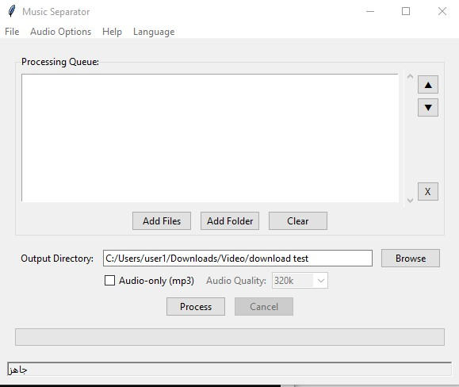
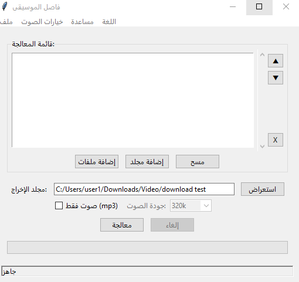

# NoMusic
Remove music from video and Audio  files
# 🎵 Music Cleaner (NoMusic) منظف الموسيقى

## English

### 🎵 Music Cleaner (NoMusic): Enjoy Calmer Content for Your Kids

**Music Cleaner (NoMusic)** is a powerful, free desktop application for Windows, born from a personal need: the desire to watch cartoons and children's shows with my kids without the constant background music. I hope this work can be of benefit to others.

### 📖 The Story Behind This App

This program was created entirely with the help of Artificial Intelligence. I am not a programmer, but I had a clear goal: to find an easy way to remove music from the children's shows I download to play on our TV.

The initial Python script was created relatively quickly, but the journey to turn it into a real, user-friendly application that works reliably on different computers was a long road of trial and error. I am grateful for the guidance that made it possible.

### ✨ Why Choose This Software?

| Feature | Description |
|---|---|
| 🎯 **Designed with a Purpose** | Built specifically for families looking for quieter, music-free content for their children. |
| 💻 **Works Entirely Offline** | No need to upload your files. Your privacy and security are 100% guaranteed. |
| 🌐 **No Internet Required** | Once downloaded, you can use the application anywhere, anytime. |
| 🚀 **Smart & Adaptive** | The app automatically adjusts its performance based on your computer's resources, ensuring maximum speed on powerful machines and stability on weaker ones. |
| 💎 **Professional Extra Features** | Includes a "Improve Voice Clarity" option to enhance the final audio quality, plus advanced settings like preventing sleep mode. |
| 💸 **100% Free** | No hidden fees, no subscriptions, and no limits. This software is completely free. |

### 📥 Download & Installation

1.  Go to the **[Releases Page](https://studentksuedu-my.sharepoint.com/:u:/g/personal/441106740_student_ksu_edu_sa/ES8smub4HsxNi4ig_p6FTgMBT5KMmINvAfN53-V0DYKY6A?e=MevR9G)**.
2.  Download the latest `setup.exe` file.
3.  Run the installer and follow the simple steps.

### ❤️ Support the Project

If you find this software useful, please consider supporting its continued development via:
- **[Ko-fi](https://ko-fi.com/cvdesign)**
- **[PayPal](mailto:hassan_mohammed32@yahoo.com)**

##  Arabic - عربي

### 🎧 برنامج منظف الموسيقى (نو ميوزيك): شاهد برامج أطفالك بصفاء وهدوء

**نو ميوزيك** هو برنامج مكتبي مجاني وقوي لأنظمة ويندوز، وُلد من حاجة شخصية: الرغبة في مشاهدة برامج الأطفال والكارتون مع أطفالي دون وجود موسيقى خلفية مستمرة. أسأل الله أن يكون هذا العمل صدقة جارية.

### 📖 قصة البرنامج

تم إنشاء هذا البرنامج بالكامل بمساعدة الذكاء الاصطناعي. أنا لست مبرمجًا، ولكن كان لدي هدف واضح: إيجاد طريقة سهلة لحذف الموسيقى من برامج الأطفال التي أحملها من الإنترنت لأعرضها على شاشة التلفزيون.

الكود الأساسي بلغة بايثون لم يستغرق وقتًا طويلاً، لكن رحلة تحويله إلى برنامج حقيقي بواجهة رسومية سهلة، يعمل على مختلف الأجهزة بإمكانياتها المتفاوتة، كانت رحلة طويلة من التجربة والخطأ. والحمد لله الذي أعان ووفق.

### ✨ لماذا تختار هذا البرنامج؟

| الميزة | الشرح |
|---|---|
| 🎯 **مصمم لهدف نبيل** | تم بناؤه خصيصًا للعائلات التي تبحث عن محتوى هادئ وخالٍ من الموسيقى لأطفالها. |
| 💻 **يعمل بالكامل على جهازك** | لا حاجة لرفع ملفاتك على الإنترنت. خصوصيتك وأمان ملفاتك مضمونة 100%. |
| 🌐 **لا يتطلب اتصال بالإنترنت** | بمجرد تحميل البرنامج، يمكنك استخدامه في أي مكان وزمان. |
| 🚀 **ذكي ومتكيف** | يقوم البرنامج تلقائيًا بضبط أدائه بناءً على قوة جهازك لضمان أفضل سرعة ممكنة على الأجهزة القوية واستقرار تام على الضعيفة. |
| 💎 **ميزات احترافية إضافية** | يحتوي على خيار "تحسين وضوح الصوت" لتعزيز جودة الصوت الناتج، بالإضافة إلى خيارات متقدمة مثل منع السكون وتخطي الملفات المعالجة. |
| 💸 **مجاني 100% كصدقة جارية** | لا توجد رسوم خفية، لا اشتراكات، ولا حدود. البرنامج مجاني تمامًا كعمل يبتغى به وجه الله. |
### 📥 التحميل والتثبيت

1.  اذهب إلى **[صفحة الإصدارات (Releases)](https://studentksuedu-my.sharepoint.com/:u:/g/personal/441106740_student_ksu_edu_sa/ES8smub4HsxNi4ig_p6FTgMBT5KMmINvAfN53-V0DYKY6A?e=MevR9G)**.
2.  قم بتحميل أحدث ملف `setup.exe`.
3.  قم بتشغيل الملف واتبع خطوات التثبيت البسيطة.

### ❤️ ادعم المشروع

إذا وجدت هذا البرنامج مفيدًا وحقق لك الهدف المرجو منه، يمكنك المساعدة في استمرار هذا العمل ودعمه عبر:
- **[Ko-fi](https://ko-fi.com/cvdesign)**
- **[PayPal](mailto:hassan_mohammed32@yahoo.com)**

---
